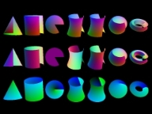

TIFF Tools Overview
===================

This software distribution comes with a small collection of
programs for converting non-TIFF format images to TIFF and for
manipulating and interrogating the contents of TIFF images. Several
of these tools are useful in their own right. Many of them however
are more intended to serve as programming examples for using the
TIFF library.

Manual pages
------------

.. toctree::
    :maxdepth: 1
    :titlesonly:

    tools/fax2ps
    tools/fax2tiff
    tools/pal2rgb
    tools/ppm2tiff
    tools/raw2tiff
    tools/rgb2ycbcr
    tools/thumbnail
    tools/tiff2bw
    tools/tiff2pdf
    tools/tiff2ps
    tools/tiff2rgba
    tools/tiffcmp
    tools/tiffcp
    tools/tiffcrop
    tools/tiffdither
    tools/tiffdump
    tools/tiffgt
    tools/tiffinfo
    tools/tiffmedian
    tools/tiffset
    tools/tiffsplit

Device-dependent Programs
-------------------------

There are two device-dependent programs that serve as simple
examples for writing programs to display and save TIFF images.

.. list-table:: Device-dependent programs
    :widths: 5 20
    :header-rows: 1

    * - Tool
      - Description

    * - :doc:`tools/tiffgt`
      - Display the contents of one or more TIFF images using OpenGL.
        The software makes extensive use of the ``TIFFRGBAImage``
        facilities described elsewhere.

Device-independent Programs
---------------------------

The remaining programs should be device-independent:

.. list-table:: Device-dependent programs
    :widths: 5 20
    :header-rows: 1

    * - Tool
      - Description

    * - :doc:`tools/fax2ps`
      - Convert a Group 3- or Group 4- compressed TIFF to PostScript
        that is significantly more compressed than is generated by
        :program:`tiff2ps` (unless :program:`tiff2ps` writes PS Level II)

    * - :doc:`tools/fax2tiff`
      - Convert raw Group 3 or Group 4 facsimile data to TIFF

    * - :doc:`tools/pal2rgb`
      - Convert a Palette-style image to a full color RGB image by
        applying the colormap

    * - :doc:`tools/ppm2tiff`
      - A quick hack that converts 8-bit PPM format images to TIFF

    * - :doc:`tools/raw2tiff`
      - Create a TIFF file from raw data

    * - :doc:`tools/rgb2ycbcr`
      - Convert an RGB, grayscale, or bilevel TIFF image to a YCbCr
        TIFF image; it's mainly provided for testing

    * - :doc:`tools/thumbnail`
      - Copy a bilevel TIFF to one that includes 8-bit greyscale
        "thumbnail images" for each page; it is provided as an example of
        how one might use the ``SubIFD`` tag (and the library support
        for it)

    * - :doc:`tools/tiff2bw`
      - A simple program to convert a color image to grayscale 

    * - :doc:`tools/tiff2pdf`
      - Convert TIFF images to PDF

    * - :doc:`tools/tiff2ps`
      - Convert TIFF images to PostScript

    * - :doc:`tools/tiff2rgba`
      - Convert a TIFF image to RGBA color space

    * - :doc:`tools/tiffcmp`
      - Compare the contents of two TIFF files (it does not check all
        the directory information, but does check all the data)

    * - :doc:`tools/tiffcp`
      - Copy, concatenate, and convert TIFF images (e.g. switching from
        ``Compression=5`` to ``Compression=1``) 

    * - :doc:`tools/tiffcrop`
      - Provides selection of images from within one or more multi-image
        TIFF files, with orthogonal rotation, mirroring, cropping, and
        extraction of multiple sections and exporting to one or more files.
        It extends the functionality of :program:`tiffcp` to support additional bit
        depths in strips and tiles and enhances the selection capabilities of
        tiffsplit. Bilevel images can be inverted and images may be split into
        segments to fit on multiple /pages/ (standard paper sizes), plus other
        functions described in the tiffcrop man page 

    * - :doc:`tools/tiffdither`
      - Dither a b&w image into a bilevel image (suitable for use
        in creating fax files)

    * - :doc:`tools/tiffdump`
      - Display the verbatim contents of the TIFF directory in a file
        (it's very useful for debugging bogus files that you may get from
        someone that claims they support TIFF)

    * - :doc:`tools/tiffinfo`
      - Display information about one or more TIFF files

    * - :doc:`tools/tiffmedian`
      - A version of Paul Heckbert's median cut program that reads an
        RGB TIFF image, and creates a TIFF palette file as a result

    * - :doc:`tools/tiffset`
      - Set a field in a TIFF header

    * - :doc:`tools/tiffsplit`
      - Create one or more single-image files from a (possibly)
        multi-image file

Check out the manual pages for details about the above programs.
